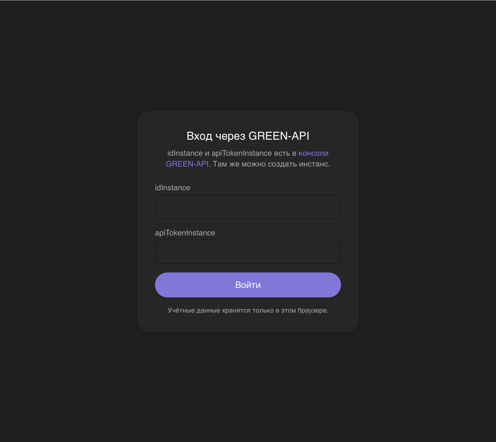
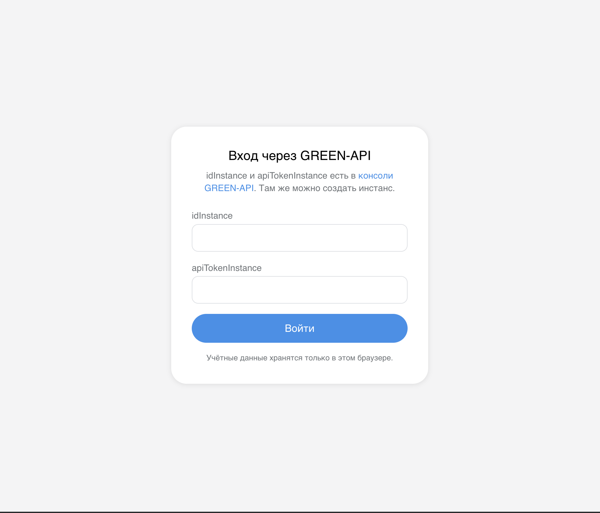
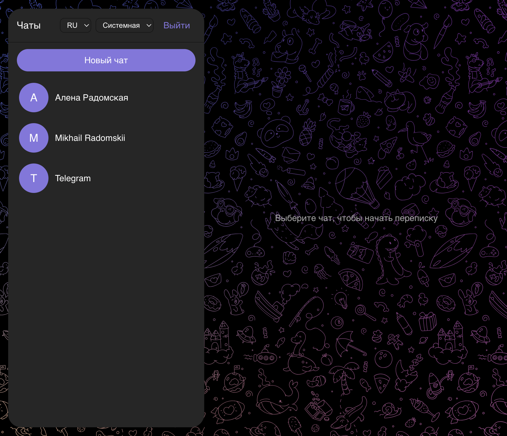
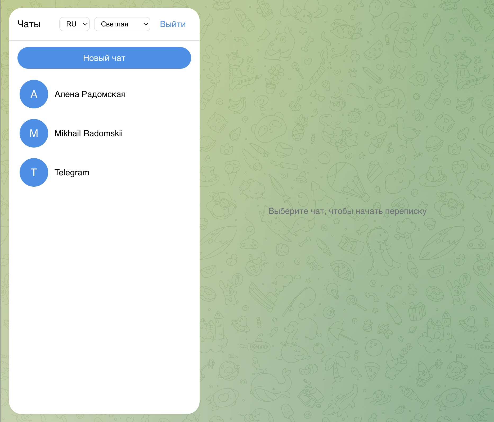
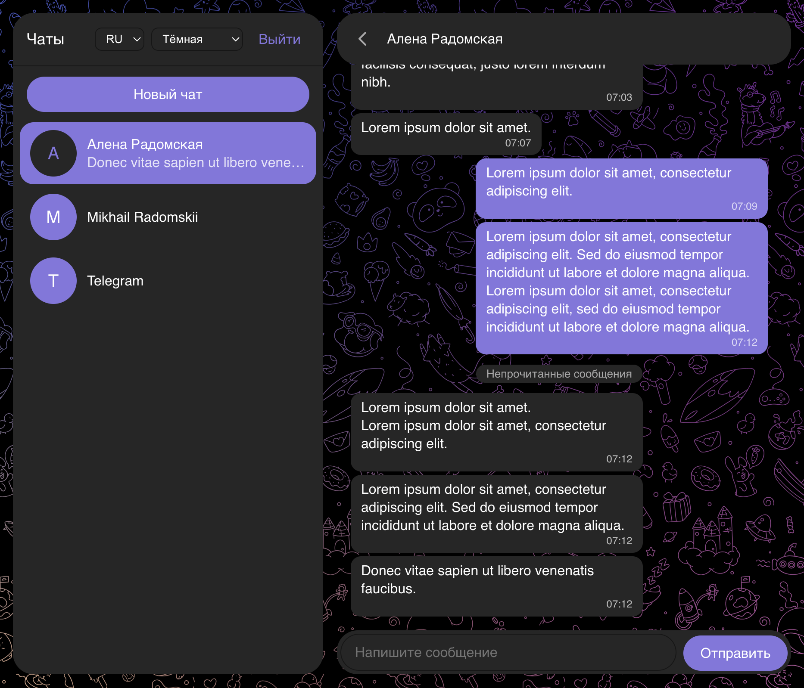
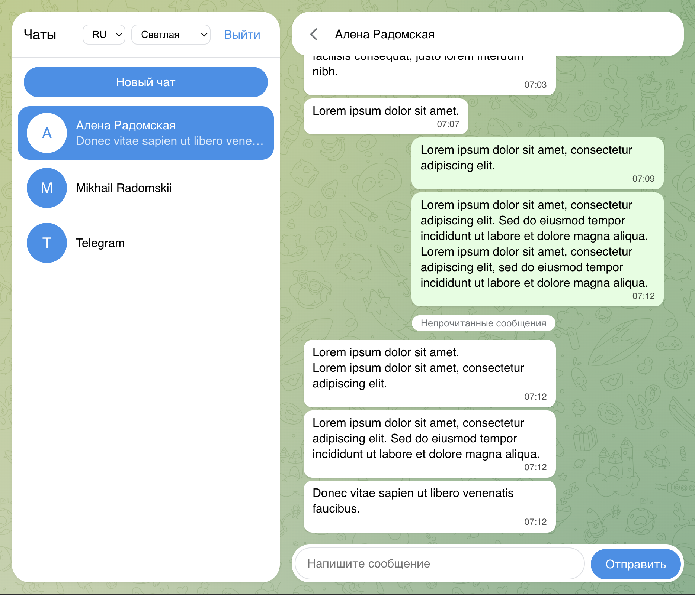
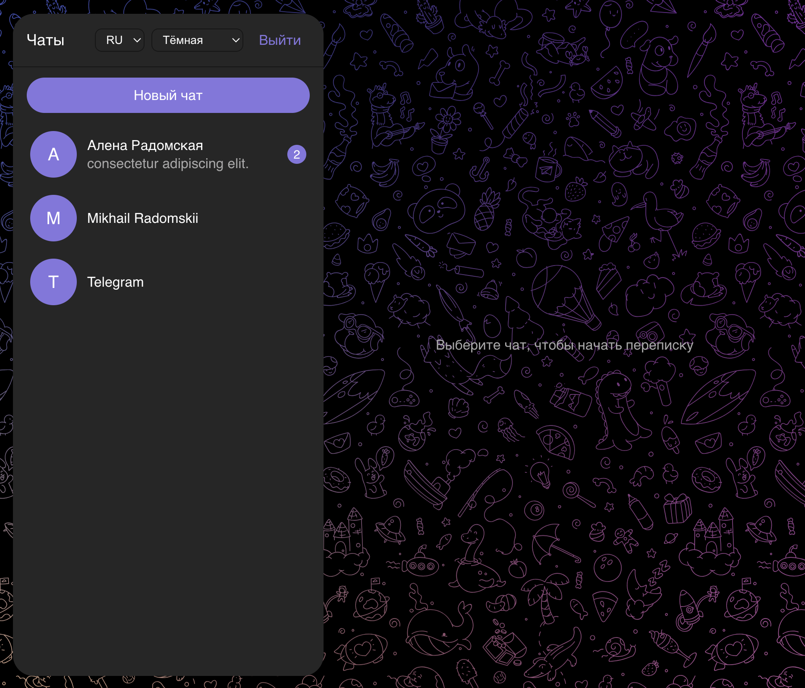
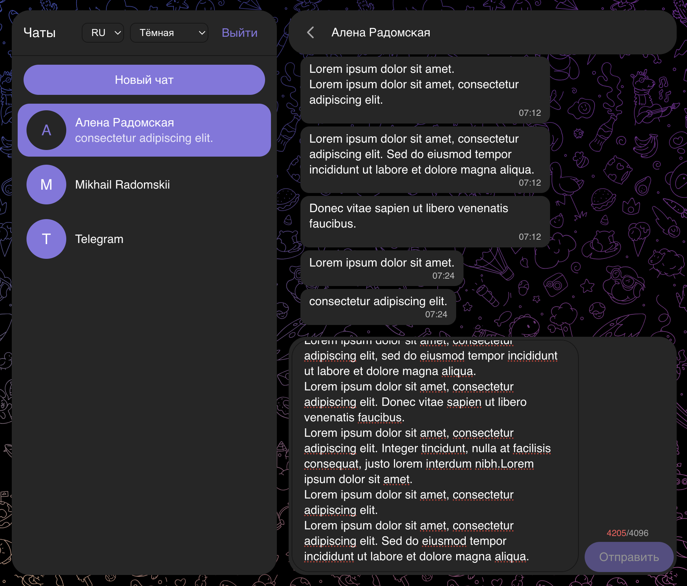
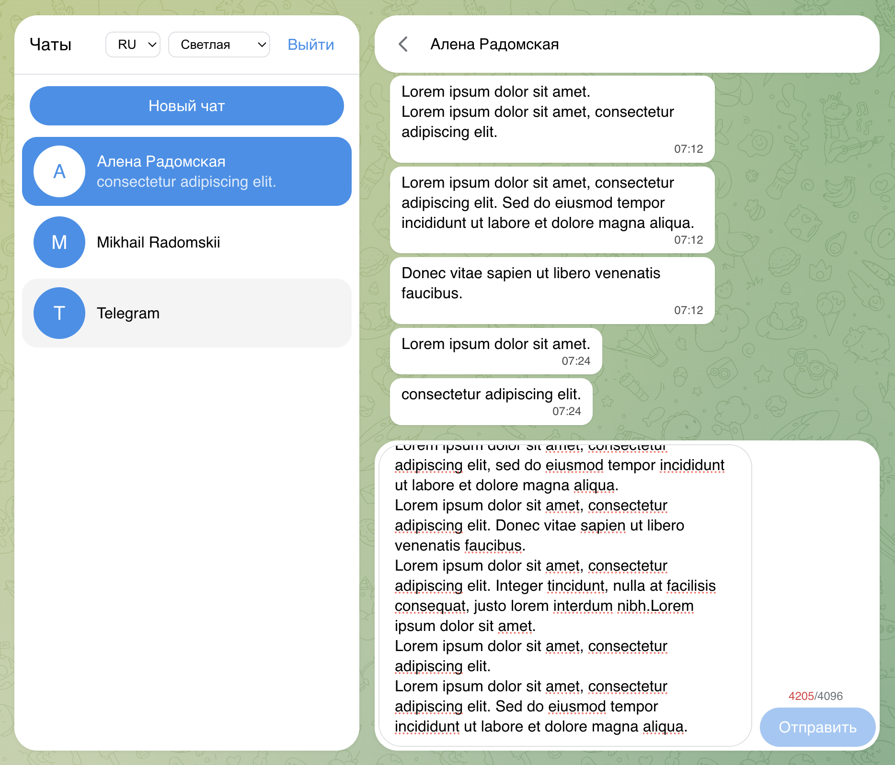

# messenger-web-client

A web client for sending and receiving text messages in Telegram through
[GREEN-API](https://green-api.com/telegram). Docs:
[GREEN-API: Telegram](https://green-api.com/telegram/docs/api/).

**Live demo:** <https://radomskaia.github.io/messenger-web-client/>

Stack: React 19, TypeScript, Vite, CSS Modules.

## Screenshots

The interface follows the system light/dark theme; the columns below show the
same screens in each.

<table>
  <tr>
    <th width="120"></th>
    <th>Dark</th>
    <th>Light</th>
  </tr>
  <tr>
    <th align="left">Sign in with <code>idInstance</code> and <code>apiTokenInstance</code></th>
    <td></td>
    <td></td>
  </tr>
  <tr>
    <th align="left">Chat list</th>
    <td></td>
    <td></td>
  </tr>
  <tr>
    <th align="left">Conversation, with the unread divider</th>
    <td></td>
    <td></td>
  </tr>
  <tr>
    <th align="left">Per-chat unread badge</th>
    <td></td>
    <td></td>
  </tr>
  <tr>
    <th align="left">Live character counter — Send disabled past the 4096-character limit</th>
    <td></td>
    <td></td>
  </tr>
</table>

## Running locally

Prerequisites: Node 24.15.0 (pinned in `.nvmrc` — `nvm use` picks it up) and npm.

1. Create a Telegram instance in the [GREEN-API console](https://console.green-api.com)
   and copy its `idInstance` and `apiTokenInstance`.
2. `npm install`, then `npm run dev` and open the printed URL.
3. Enter the credentials, create a chat with a recipient's phone number, and send
   a message.

To serve a production build locally instead: `npm run build && npm run preview`.

### How receiving works

GREEN-API delivers incoming messages through a FIFO queue rather than a socket.
The client polls `receiveNotification`, applies the notification, and always
acknowledges it with `deleteNotification` — an unacknowledged notification is
redelivered forever and blocks every later one. Because delivery is at-least-once
and outgoing messages are echoed back, every message is deduplicated by
`idMessage`. If sending fails, the message stays visible as "Not sent" and the
typed text is returned to the input box so it can be edited and sent again;
there is deliberately no retry button.

### Localisation and theme

The app is localised in Russian and English, switchable from the sidebar, and
follows the system light/dark theme by default.

### Security note

`apiTokenInstance` is stored in this browser's `localStorage` so a reload does not
sign you out. This is acceptable for a disposable demo instance and **not** for a
production deployment: a real deployment needs a backend that holds the token and
proxies the calls. Use "Sign out" to clear it.

## Scripts

| Command                               | Purpose                        |
| ------------------------------------- | ------------------------------ |
| `npm run dev`                         | Vite dev server                |
| `npm run build`                       | Type check + production build  |
| `npm run preview`                     | Serve the built bundle locally |
| `npm run typecheck`                   | `tsc -b` without bundling      |
| `npm run lint` / `lint:fix`           | ESLint (zero warnings allowed) |
| `npm run stylelint` / `stylelint:fix` | Stylelint over CSS             |
| `npm run format` / `format:check`     | Prettier                       |
| `npm test` / `test:watch`             | Vitest + Testing Library       |

## Code quality

- **TypeScript** in strict mode: `strict`, `noUncheckedIndexedAccess`,
  `exactOptionalPropertyTypes`, `noPropertyAccessFromIndexSignature` and more.
  Shared options live in `tsconfig.base.json`.
- **ESLint** (flat config): `typescript-eslint` with `strictTypeChecked` +
  `stylisticTypeChecked` (type-aware rules), `react-hooks`, `react-refresh`,
  `unicorn`, and import ordering via `import-x`. `eslint-config-prettier` comes last.
- **Stylelint**: `stylelint-config-standard` plus property ordering, with camelCase
  class names for CSS Modules.
- **Prettier** is the single source of truth for formatting.

## Git hooks

Installed automatically by `npm install` (`prepare: husky`).

- `pre-commit` — `lint-staged` over changed files, then `npm run typecheck`
- `commit-msg` — `commitlint` with [Conventional Commits](https://www.conventionalcommits.org/)
- `pre-push` — `npm test`

Commit message format: `<type>(<scope>): <description>`, for example
`feat(chat): send text message`.
Types: `feat`, `fix`, `docs`, `style`, `refactor`, `perf`, `test`, `build`, `ci`,
`chore`, `revert`.

## Import alias

`@/*` maps to `src/*` (configured in `tsconfig.app.json` and `vite.config.ts`).
